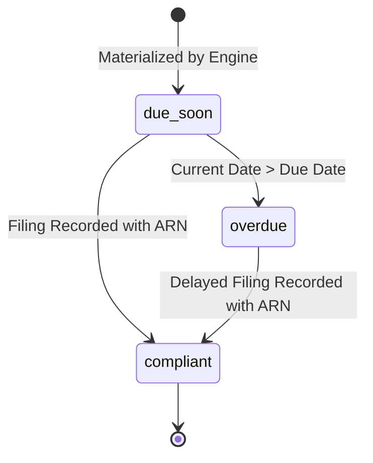

# Saarthi Compliance Core Architecture & Regulatory Engine

## 1. Overview
The Compliance Core module is the engine of Saarthi. It translates complex Central and State statutory requirements into discrete, scheduled compliance instances for Indian MSMEs, monitors upcoming and overdue deadlines, and stores verifiable audit proof of filings.

---

## 2. Regulatory Taxonomy & Coverage

### 2.1 Central Indian Acts Seeded
1. **Central Goods and Services Tax (CGST) Act, 2017:**
   - `GST_GSTR1_MONTHLY`: Monthly return for outward supplies (Due 11th of next month).
   - `GST_GSTR3B_MONTHLY`: Monthly summary return and tax remittance (Due 20th of next month).
2. **Micro, Small and Medium Enterprises Development (MSMED) Act, 2006:**
   - `UDYAM_ANNUAL_UPDATE`: Annual update of turnover & investment figures on the Udyam portal to maintain priority status (Due June 30).
3. **Food Safety and Standards Act, 2006 (FSSAI):**
   - `FSSAI_ANNUAL_RETURN_D1`: Form D-1 annual return for food manufacturing & repacking units (Due May 31).
4. **Income Tax Act, 1961:**
   - `IT_ADVANCE_TAX_Q1`: First Advance Tax installment 15% (Due June 15).
   - `IT_ADVANCE_TAX_Q2`: Second Advance Tax installment 45% (Due Sept 15).
   - `IT_ADVANCE_TAX_Q3`: Third Advance Tax installment 75% (Due Dec 15).
   - `IT_ADVANCE_TAX_Q4`: Fourth Advance Tax installment 100% (Due March 15).
5. **Employees' Provident Funds and Miscellaneous Provisions Act, 1952:**
   - `EPF_MONTHLY_ECR`: Monthly electronic challan cum return for entities with 20+ staff (Due 15th of next month).

### 2.2 Uttar Pradesh State Acts Seeded
1. **UP Dookan Aur Vanijya Adhishthan Adhiniyam, 1962:**
   - `UP_SHOPS_ANNUAL_RENEWAL`: Annual establishment registration renewal for UP commercial premises (Due Dec 31).
2. **UP Pollution Control Board (UPPCB) Consent Regulations:**
   - `UPPCB_CTO_RENEWAL`: Periodic air/water Consent to Operate renewal for manufacturing units (Annual).

---

## 3. Applicability Rules Engine

The applicability rules engine (`ComplianceService.evaluateApplicability`) computes whether a statutory requirement applies to an enterprise based on:
- **Jurisdiction State:** Central acts apply nationwide (`jurisdictionState = null`), state acts check against `business.jurisdiction_state` (e.g. `UP`).
- **Registrations:** Requires `business.gstin`, `business.udyam_number`, `business.fssai_number`, or `business.pan`.
- **Industry Sector:** Matches exact sector strings or sector arrays (e.g., `Food Processing & Confectionery`).
- **Employee Band:** Threshold comparisons (e.g. `min_employees = 20` checks against `employee_count_band`).
- **Turnover Band:** Threshold evaluation for Advance Tax and audit thresholds.

---

## 4. Lifecycle & Status Transition

- **`due_soon`:** Generated for upcoming statutory window.
- **`overdue`:** Automatically dynamically evaluated if `now > due_date` without a valid filing record.
- **`compliant`:** Transitioned when authorized user records a valid filing acknowledgement / challan reference and optional receipt document URL.
- **Audit Logging:** Every filing creation emits an append-only `COMPLIANCE_FILING_RECORDED` audit event.

---

## 5. Background Jobs & Worker Queue

- **Queue Name:** `compliance` (Redis/BullMQ).
- **Scheduled Job:** `compliance-daily-scan` evaluates due dates across active businesses daily, transitioning overdue statuses and enqueuing alert jobs on the `notifications` queue.
- **Generation Job:** `compliance-instance-generator` generates instances when an enterprise updates registrations or changes operating parameters.
