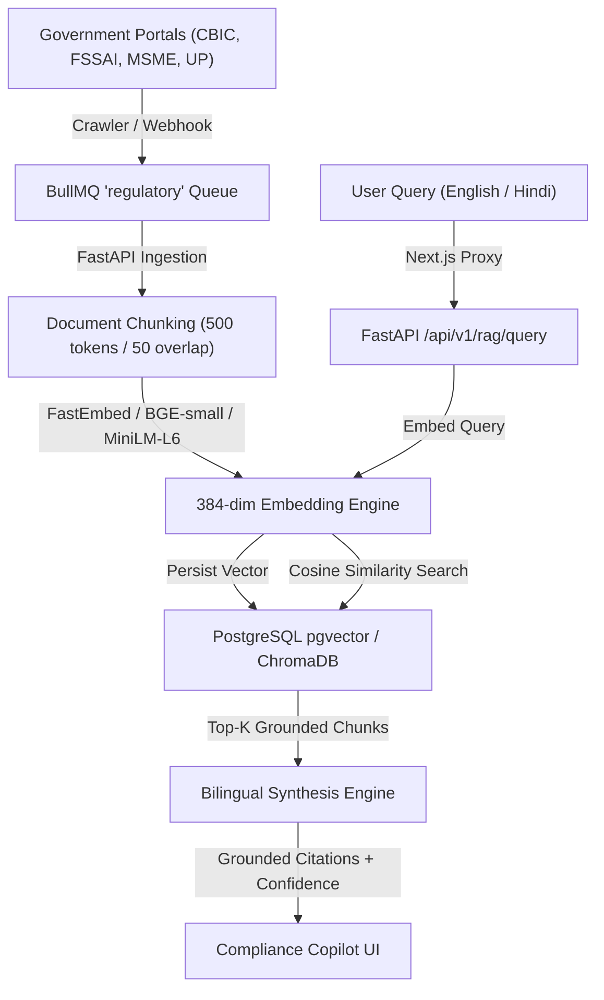

# Saarthi Regulatory Intelligence & Grounded RAG Pipeline

## 1. Overview
The Regulatory Intelligence and RAG subsystem continuously ingests, processes, and serves official Indian statutory circulars, central and state notifications, and compliance advisories. It powers the bilingual Compliance Copilot, ensuring that every piece of guidance is directly grounded in authoritative government sources with verifiable citations.

---

## 2. Architecture & Vector Ingestion

---

## 3. Chunking & Embedding Strategy

- **Chunk Size:** 500 characters with 10% overlap to preserve statutory clauses and rule numbers.
- **Embedding Space:** 384 dimensions (`BAAI/bge-small-en-v1.5` / `sentence-transformers/all-MiniLM-L6-v2` compatible).
- **Fast Local Fallback:** Pure Python normalized projection layer for rapid offline tests and sub-millisecond similarity scoring.

---

## 4. Grounding & Anti-Hallucination Guardrails

1. **Mandatory Citations:** Every Copilot response returns structured citation objects containing:
   - `title`: Official circular name and notification number.
   - `source`: Authority name (e.g. `CBIC`, `FSSAI`, `UP Government`).
   - `url`: Direct canonical URL to the government portal.
   - `relevance_score`: Cosine similarity score between query and chunk.
2. **Impact Matrix Formulation:** Circular summaries automatically extract:
   - `impacted_entities`: Who needs to take action (e.g. `Turnover > ₹5 Cr`).
   - `key_deadline`: Precise statutory effective or filing date.
   - `action_required`: Actionable next step in English and Hindi.
   - `risk_level`: Severity classification (`low`, `medium`, `high`, `critical`).
3. **Audit Logging:** Every user query, returned sources, confidence score, and latency are logged in `rag_queries` for auditability and quality tracking.
